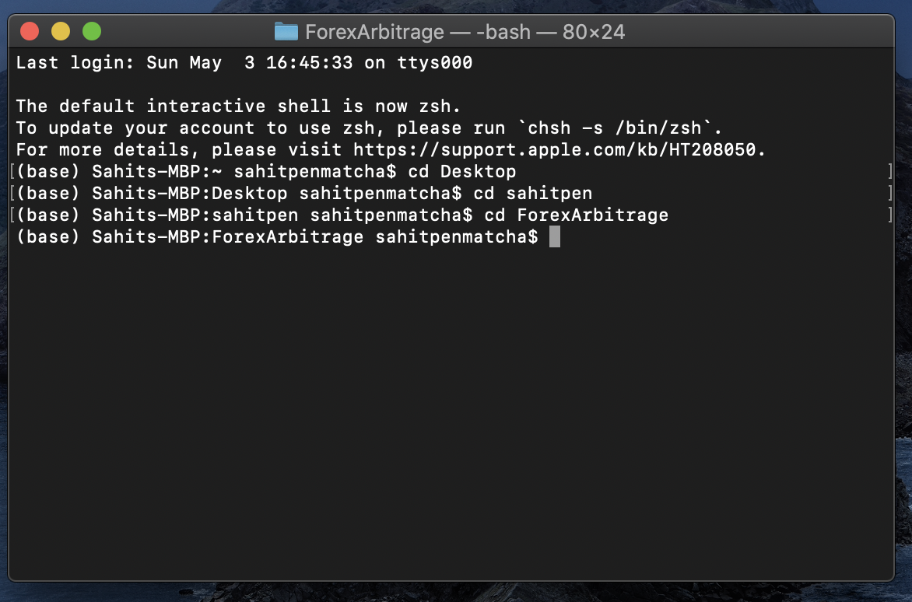
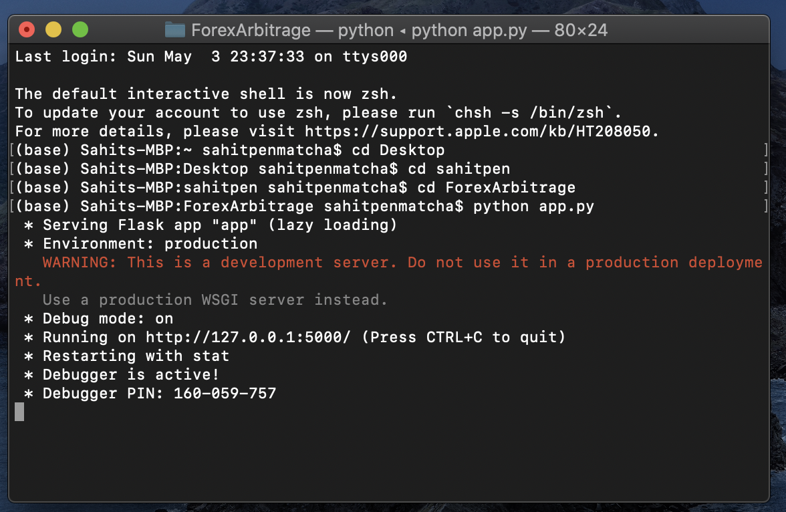
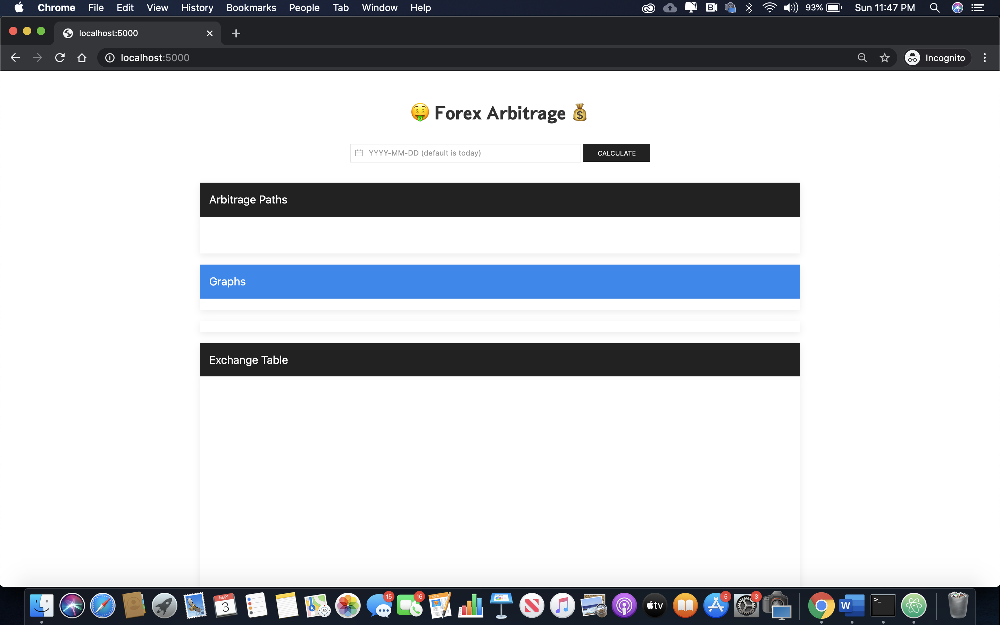
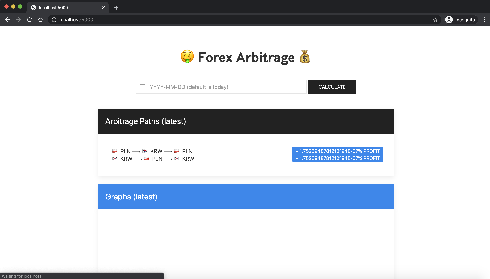
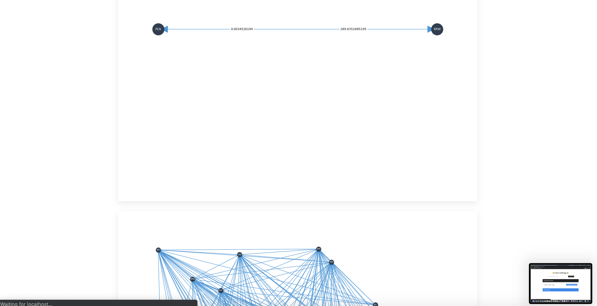
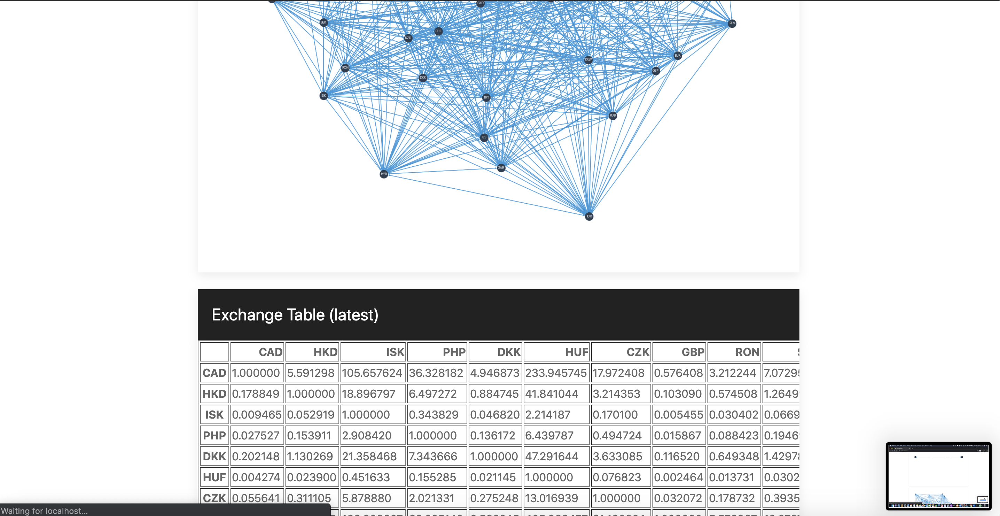
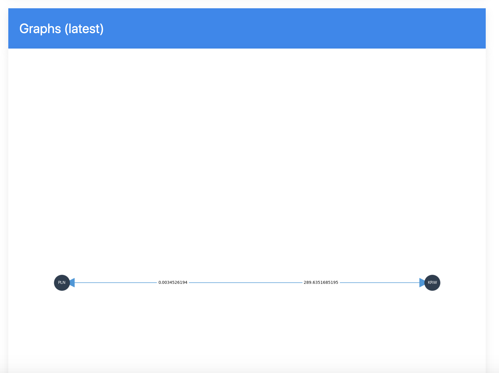
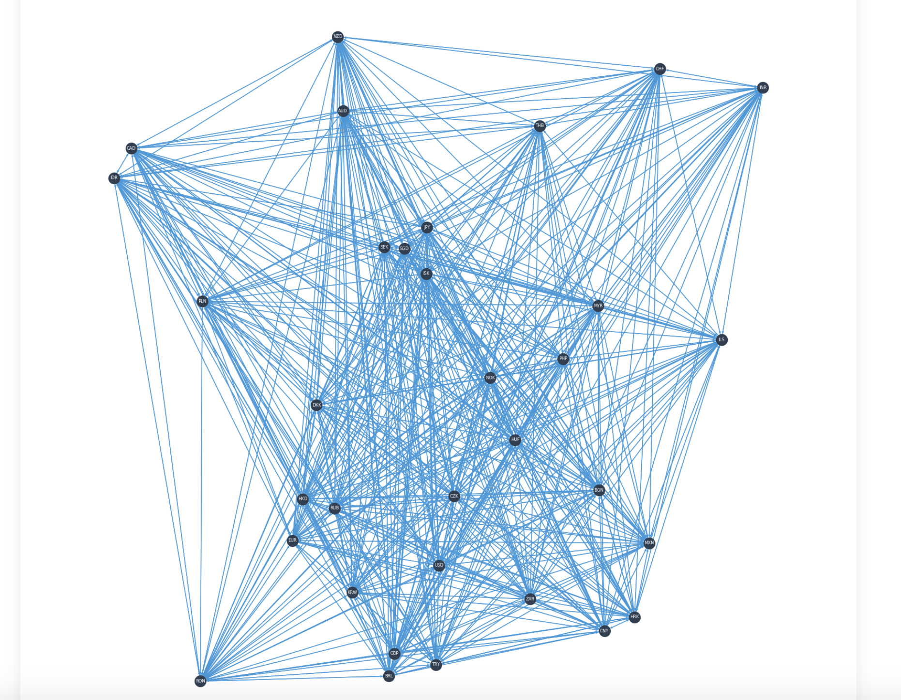

# Forex Arbitrage Finder
This program finds forex currency arbitrage opportunities.
The project consists of a Flask web-app frontend that allows for user input and
showcases arbitrage paths, exchange rate graphs, and exchange rate tables, as well
as a Python backend that pulls exchange rate information from https://exchangeratesapi.io/
and calculates arbitrage paths using a modified Bellman Ford algorithm to find negative cycles.

### Setup
First, make sure you have **Python 3** installed on your computer. Download instructions
can be found here: https://www.python.org/downloads/. Make sure that you have the
latest version of pip as well.

Then, on the command line, navigate to the location on your computer where you
unzipped the submission folder and from there, navigate inside the ForexArbitrage
folder. If the submission files are unzipped on the desktop, the commands should look
like this:
```
cd Desktop
cd sahitpen
cd ForexArbitrage
```
It should look something like this:


Now, we need to install all the python dependencies that the project uses. Enter
the following command:  
```
pip3 install -r requirements.txt
```
All the dependencies should now download to your computer.
Now, type in the following command to start the Flask app:
```
python3 app.py
```
You should see something that looks like this:


Now, all you need to do is open up your web browser (program was tested on Chrome, so
use Chrome preferably). Navigate to http://localhost:5000/ on your web browser, and
you should see the following:


Now, you're ready to use the web-app! Simply press the calculate button and wait
for the program to calculate arbitrage paths. It may take up to a few minutes for the
results to calculate (but it usually finishes faster).
By default, if no date is specified in the text box, the program will pull the most
recent forex exchange rate information from https://exchangeratesapi.io/.

Here is a sample of what results will display after calculations are returned:




### Arbitrage Paths
The program will display all profitable arbitrage paths, given the pulled exchange
rate data. The paths represent the sequence of currencies that need to be traded
to result in a profit. The profit percentage is displayed to the right of the path in blue.


### Graphs
Two graphs will be displayed. Note that these graphs were plotted as NetworkX
graphs and converted to image files for easier HTML rendering.

The first graph contains only the currencies that
are involved in any of the calculated arbitrage paths. The weights on
the edges between nodes represent exchange rates between the currency pair. Notice
that there are two numbers on each edge. The number on the edge
that is closest to the currency node (let's call it node A) is the number of units of A needed
to purchase 1 unit of currency B (the currency that A has an edge to).


The second graph contains every single currency that the API pulled. The edge weights
are not drawn as it would be very difficult to see.


### Exchange Rate Table
This is a table of all exchange rates pulled from the API at the specified date. You can
scroll on the table to be able to see all the currencies. Also, when the program runs, a CSV file
that contains this same table will be created and saved to the directory, so you can view the table
through that file as well.


### Find Arbitrage on Particular Date
You can also type in a specific date for which you want arbitrage paths calculated for.
The date MUST be specified in the form **YYYY-MM-DD**, and you can't specify future dates. (Note
that if you try entering a date in the future, it will automatically default to today's date)


One good historical date you can try is **2017-07-23**. This date prompts the following paths:


### Note
This program is for educational purposes only. It shouldn't be used to find real-time
arbitrage opportunities because the API that is used only updates the exchange rates
once a day.
